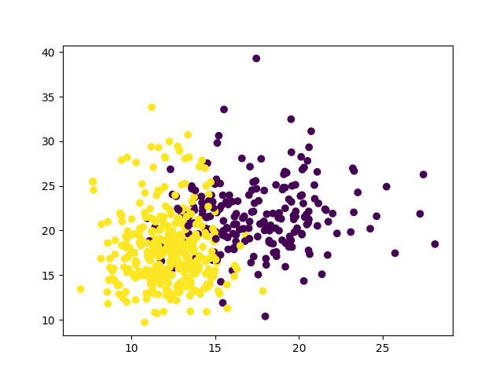
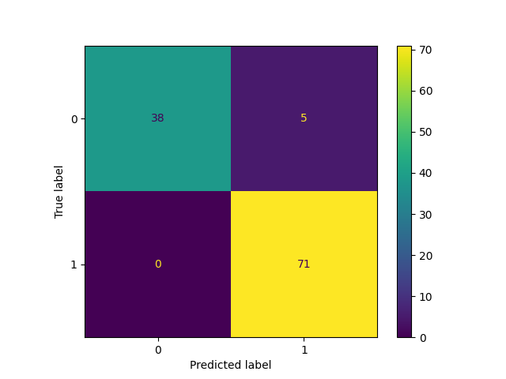

# WDBC Classification Project

## Project Title

Breast Cancer Classification Using Machine Learning

---

## Project Purpose

The purpose of this project is to build a binary classification model using the Breast Cancer Wisconsin Diagnostic (WDBC) dataset. Multiple machine learning classifiers are trained and compared to determine which model performs best.

---

## Dataset Used

Breast Cancer Wisconsin Diagnostic Dataset (WDBC)

Source:
Built-in dataset provided by scikit-learn.

Number of Samples: 569

Number of Features: 30

Classes:
- Malignant
- Benign

---

## Python Version

Python 3.10+


## Libraries Used

- NumPy
- Matplotlib
- Scikit-learn

---

## Installation

```bash
pip install -r requirements.txt
```

## Run the Program

```bash
python wdbc_classification.py
```

---

## Output Files

- wdbc_classification_scatter.png
- wdbc_classification_matrix.png
- short_report.txt

---

## Scatter Plot



---

## Confusion Matrix



---

## Classifiers Tested

- SVM
- Decision Tree
- KNN

---

## Best Classifier Result

Best Classifier: KNN

Accuracy: 95.61%

Precision: 93.42%

Recall: 100%

KNN achieved the highest accuracy among all tested classifiers and was selected as the best-performing model.